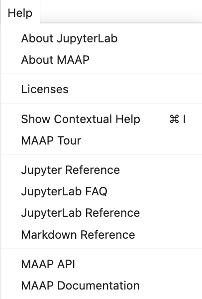
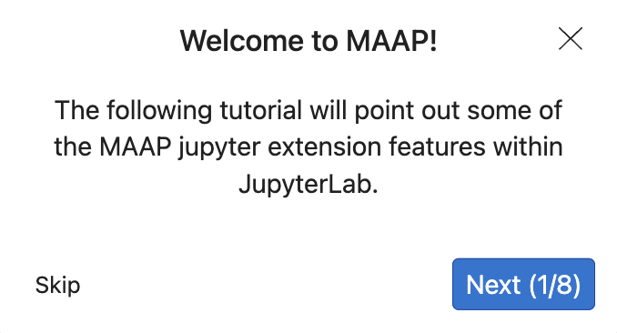

# maap-help-jupyter-extension

Jupyter extension that provides an interactive tour and adds MAAP specific information to the help tab
<br>
<br>




## Requirements

* JupyterLab >= 3.4.4

## Install

To install the extension, execute:

```bash
pip install maap_help_jupyter_extension
```

## Uninstall

To remove the extension, execute:

```bash
pip uninstall maap_help_jupyter_extension
```
## Contributing

## Development install

Note: You will need NodeJS v14 to build the extension package.


```bash
# Install package in development mode
pip install -e .
# Link your development version of the extension with JupyterLab
jupyter labextension develop . --overwrite
# Rebuild extension Typescript source after making changes
jlpm run build
```

If you would like to disable the default jupyter lab tutorial, (MAAP specific one will still be enabled), run 
```
jupyter labextension disable "jupyterlab-tour:default-tours"
```

> The `jlpm` command is JupyterLab's pinned version of
> [yarn](https://yarnpkg.com/) that is installed with JupyterLab. You may use
> `yarn` or `npm` in lieu of `jlpm` below.

The first command installs the dependencies that are specified in the
`setup.py` file and in `package.json`. Among the dependencies are also all the `JupyterLab` components that you want to use in your project.

It then runs the build script. In that step, the TypeScript code gets
converted to javascript using the compiler `tsc` and stored in a `lib`
directory. And a condensed form of the Javascript is copied in the Python
package (in the folder `maap_help_jupyter_extension/labextension`). This is the code that
would be installed by the user in JupyterLab.

The second command creates a symbolic link to the folder `maap_help_jupyter_extension/labextension` so that extension is installed in development mode in JupyterLab.

The third command allows you to update the Javascript code each time you modify your
extension code.

Now, we can run the extension. Note by adding `--watch`, we just have to refresh the browser when the project is rebuilt.

```bash
jupyter lab --watch
```

## Development uninstall

```bash
pip uninstall maap_help_jupyter_extension
```

In development mode, you will also need to remove the symlink created by `jupyter labextension develop`
command. To find its location, you can run `jupyter labextension list` to figure out where the `labextensions`
folder is located. Then you can remove the symlink named `maap-help-jupyter-extension` within that folder.

## File Structure Info

- Information about the extension:
  - `README.md` contains some instructions
  - `LICENSE` contains your extension code license; BSD-3 Clause by default (but you can change it).
- Extension code (those files are mandatory):
  - `package.json` contains information about the extension such as dependencies
  - `tsconfig.json` contains information for the typescript compilation
  - `src/plugin.ts` this contains the actual code of your extension
  - `style/` folder contains style elements that you can use
- Validation:
  - `.prettierrc` and `.prettierignore` specify the code formatter [`prettier`](https://prettier.io) configuration
  - `.eslintrc.js` and `.eslintignore` specify the code linter [`eslint`](https://eslint.org) configuration
  - `.github/workflows/build.yml` sets the continuous integration tests of the code using [GitHub Actions](https://help.github.com/en/actions)
- Packaging as a Python package:
  - `setup.py` contains information about the Python package such as what to package
  - `pyproject.toml` contains the dependencies to create the Python package
  - `MANIFEST.in` contains list of non-Python files to include in the Python package
  - `install.json` contains information retrieved by JupyterLab to help users know how to manage the package
  - `maap_help_jupyter_extension` folder contains the final code to be distributed